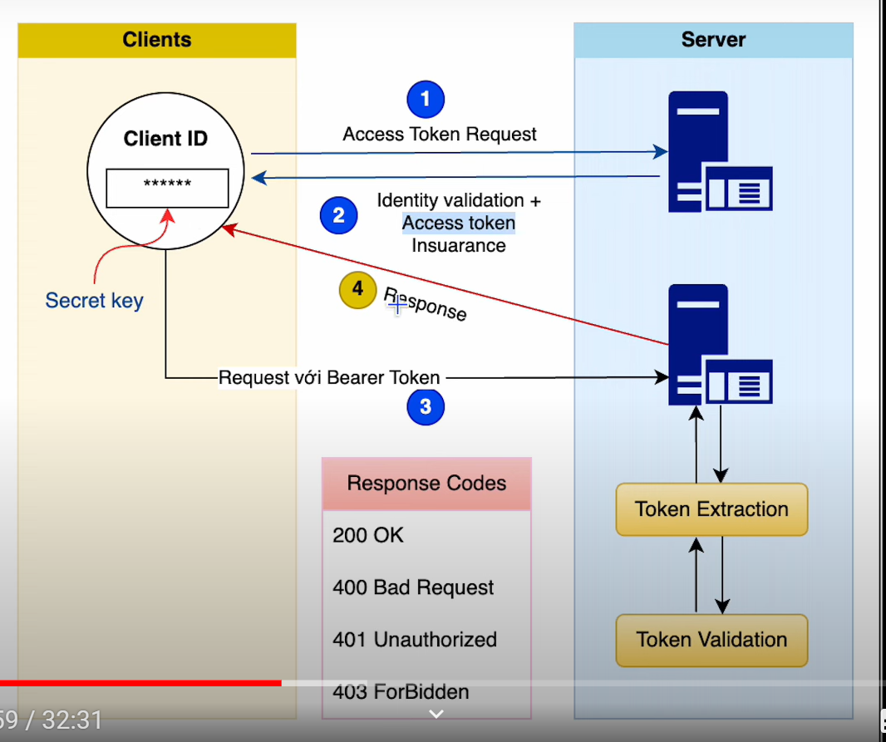
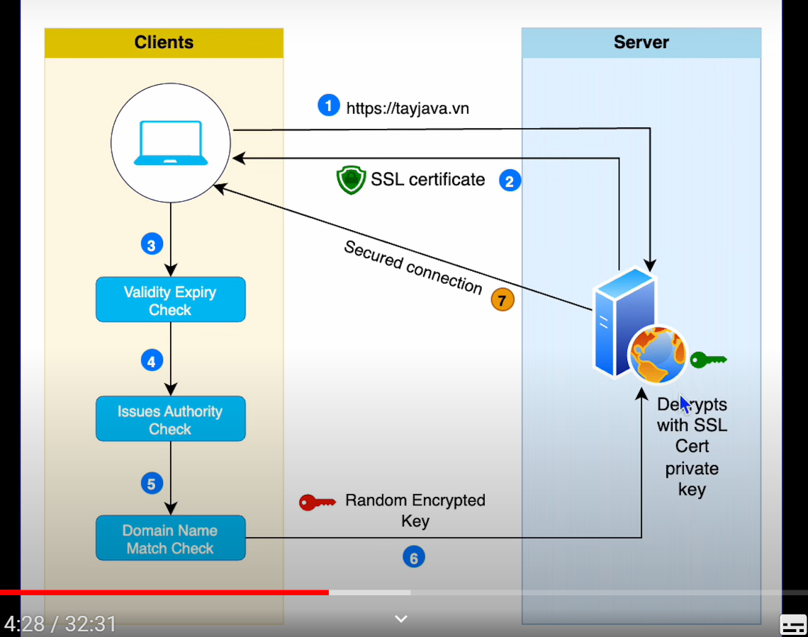
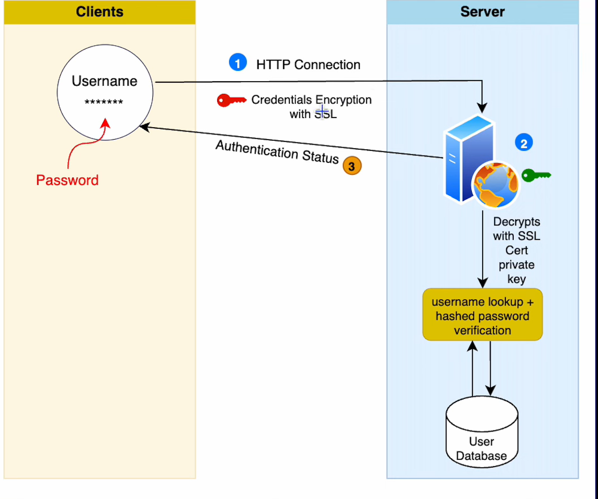
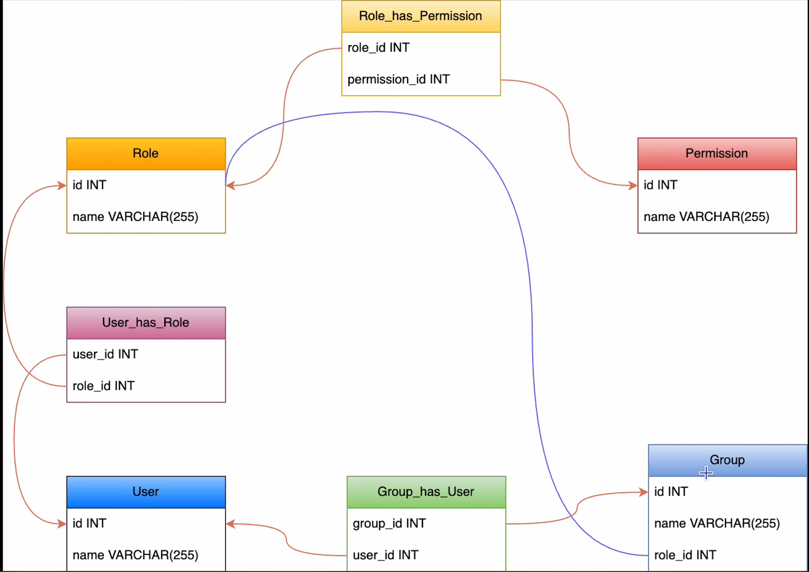
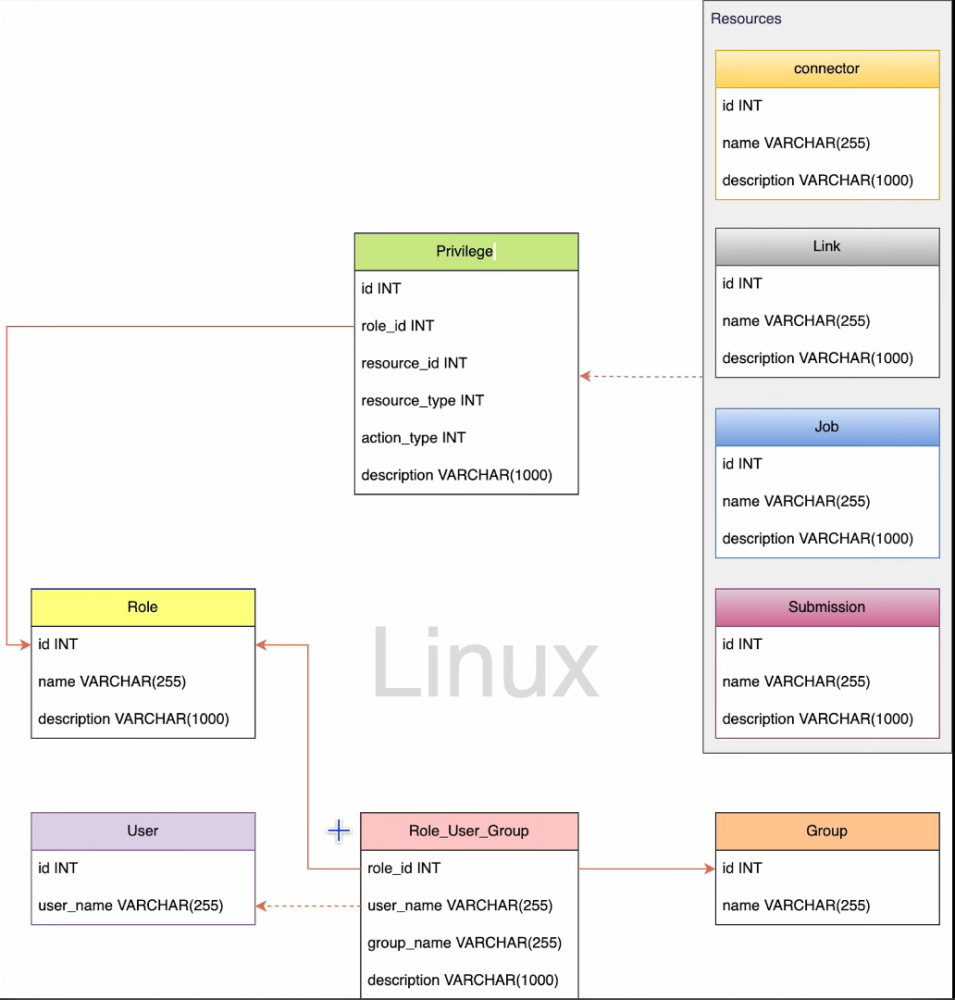

### TỔNG QUAN VỀ LÝ THUYẾT BẢO MẬT
<h3> 12 cách bảo mật API </h3>

- use https
- use oauth2
- use web authn
- use api key
- use authorization 
- rate limiting (design rule base on ip, user group)
- api versioning
- whitelist
- check owasp api security risk
- use api gateway
- error handling 
- input validation

<h3> Cách cơ chế bảo mật </h3>

- SSH keys: client gửi public key cho server (server xác thực)
- OAuth tokens: client sẽ thực hiện gửi yêu cầu đăng nhập (bao gồm user + password) (lúc này chưa kèm theo token), sau đó server sẽ thực hiện kiểm tra yêu cầu đó (bao gồm kiểm tra user,.. ) -> thành công  sẽ thực hiện gửi token về cho client. Từ đây, client thực hiện gửi request (API) + token (đã được gửi trước đó) => server sẽ thực hiện validate token và thực hiện response cho client

<h3> Cơ chế SSL </h3>

<h3> cơ chế credentials </h3>

### MÔ HÌNH RBAC (Role base on access controller) - quyền hạn gán cho Role

### MÔ HÌNH ACLIST (Access controller list) - quyền hạn gán cho user

